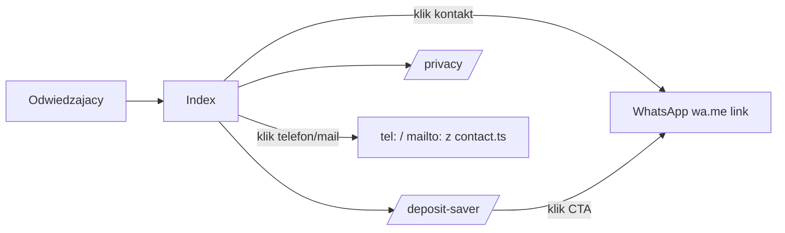

# ARCHITECTURE — mapa dla obcego (1 strona)

<!-- Cel: senior, ktory nigdy nie widzial repo, znajduje miejsce zmiany w 15 min. -->

## Co to jest (3 zdania)
Marketingowa strona handymana **QuickFix** (Reykjavík, live: quickfix.is) kierowana do polskiej
społeczności na Islandii — trójjęzyczna (EN/PL/IS), bo klient i fachowiec często nie mówią
wspólnym językiem. Flagowy produkt to **Deposit Saver**: pakiet napraw drobnych szkód
(zarysowany parkiet, pęknięta ściana, zawiasy) przed zwrotem kaucji z wynajmu. Zero bazy danych —
to strona sprzedażowa, zapytania idą przez WhatsApp/telefon/e-mail, nie przez formularz z backendem.

## Stack (z package.json / README)
- Frontend: React + TypeScript, Vite, react-router-dom (4 trasy), TanStack Query (zainicjowany, bez realnych zapytań)
- UI: Tailwind CSS + shadcn/ui (Radix), lucide-react
- Backend/DB: **brak** — statyczna strona, kontakt = WhatsApp/tel/e-mail
- i18n: `src/i18n/LanguageContext.tsx` + `translations.ts` (EN/PL/IS)
- Testy: Playwright E2E (`npx playwright test`) + Vitest (`src/test/`)
- Hosting: **Lovable** (`lovable-tagger` w `vite.config.ts`) — `git push` na `main` NIE deployuje,
  produkcję aktualizuje ręczny **Publish** w Lovable UI

## Moduły i granice (co jest gdzie)
| Katalog / plik | Odpowiedzialność | Tier |
|---|---|---|
| `src/pages/Index.tsx` | strona główna — składa sekcje (Hero, Services, BeforeAfter, TrustStats, Testimonials, FAQ, CTA) | T1 |
| `src/pages/DepositSaver.tsx` | landing produktu flagowego (osobna trasa `/deposit-saver`) | T1 |
| `src/pages/Privacy.tsx` | polityka prywatności (`/privacy`) | T0 |
| `src/lib/contact.ts` | **jedyne źródło prawdy** dla numeru tel./e-maila/linku WhatsApp (`PHONE_NUMBER`, `EMAIL`, `WHATSAPP_URL`) | T1 |
| `src/components/DemoModal.tsx` | `DemoProvider` — modal informacyjny (nie realna integracja) | T1 |
| `src/components/FloatingWhatsApp.tsx` | pływający przycisk kontaktu — używa `WHATSAPP_URL` z `contact.ts` | T1 |
| `src/i18n/*` | słownik i kontekst języka | T1 |
| `src/components/deposit-saver/*` | sekcje dedykowane landingowi Deposit Saver (before/after, FAQ, trust, testimonials) | T1 |
| `src/components/ui/*` | shadcn/ui prymitywy | T0 |

## Przepływ użytkownika

## Gdzie jest…
- numer telefonu / e-mail / WhatsApp: WYŁĄCZNIE `src/lib/contact.ts` — nigdy nie hardkoduj gdzie indziej
- teksty PL/IS/EN: `src/i18n/translations.ts`
- ceny pakietu Deposit Saver: `src/pages/DepositSaver.tsx` / `src/components/deposit-saver/*`
- sekrety: brak (brak integracji zewnętrznych wymagających kluczy)

## Decyzje nieodwracalne
`docs/adr/` — zobacz istniejące ADR w repo.

## Jak to cofnąć / kill switch
Strona statyczna bez backendu — rollback = Lovable "Revert to this version" albo `git revert` + Publish.
